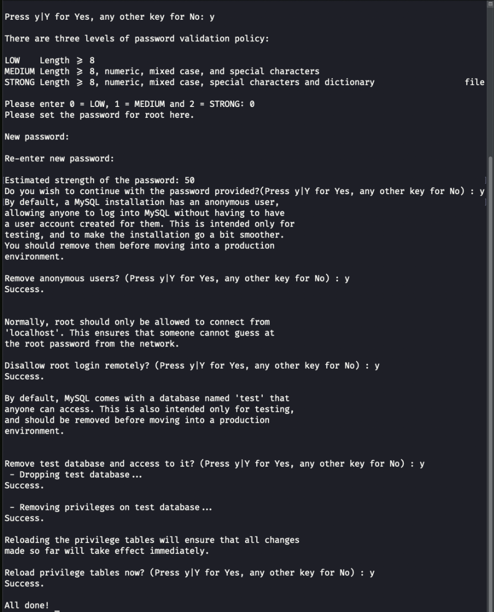
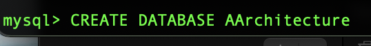
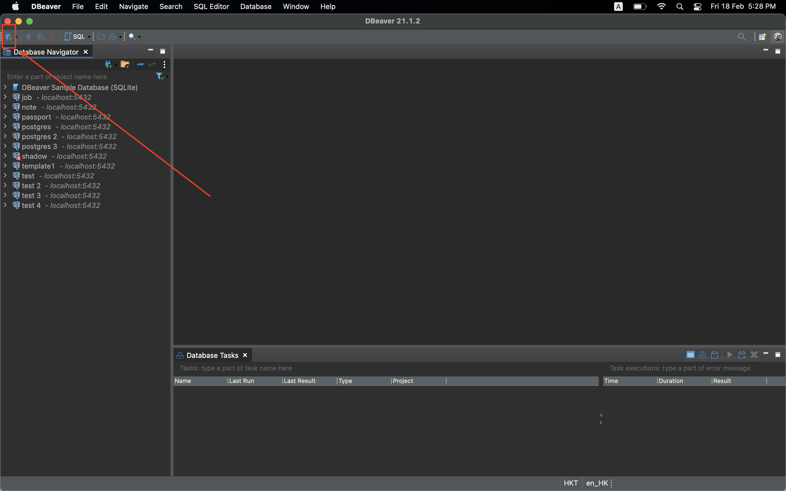
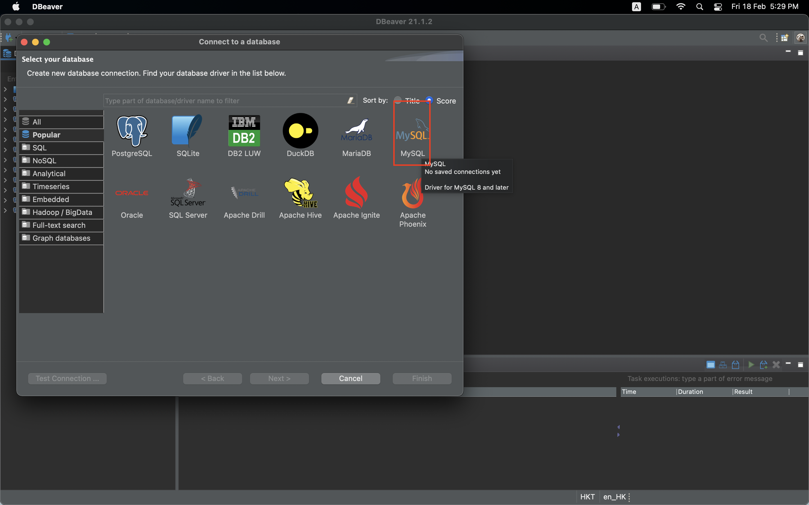
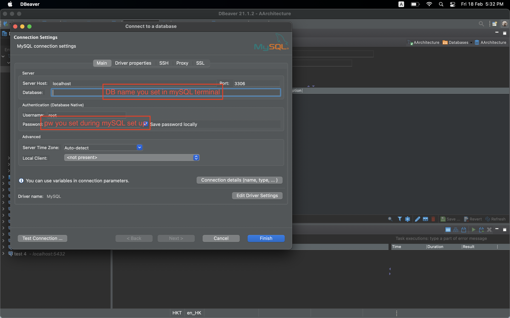

install mySQL through homebrew repository, run:
> $ brew install mysql

start the service before setup, run:
> $ brew services start mysql

.then, setup the root user with password, run:
> $ mysql_secure_installation  

  

.then, you can connect to mySQL through running:
> $ mysql -u root -p

.then, set up database by running: (in the mySQL env):
> $ CREATE DATABASE "the name you want"  

for DB UI, https://tableplus.com or DBeaver can work.  
  
  
  